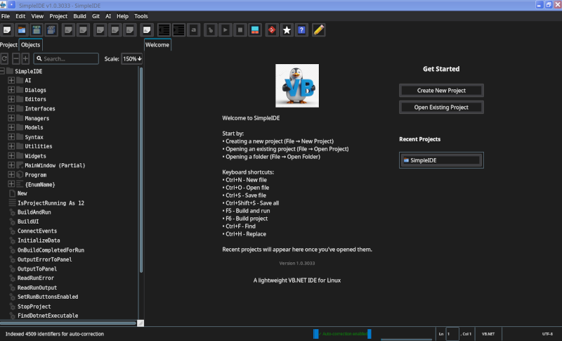
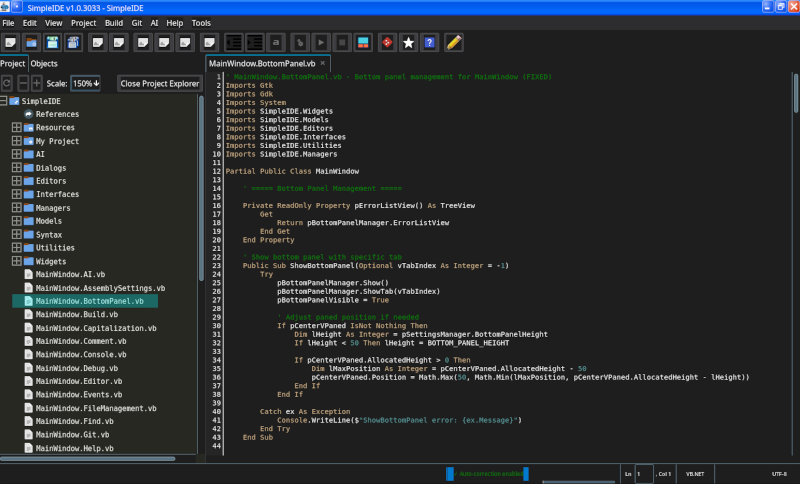

# SimpleIDE

A lightweight, professional VB.NET IDE built with GTK# 3 on Linux using .NET 8.0. SimpleIDE provides a modern development environment specifically designed for VB.NET projects on Linux systems.




## Discord

![Discord Channel}(https://discordapp.com/channels/682603493386747904/1408457691734737007)

## Features

### Code Editor
- **Multi-file tabbed editing** with automatic file type detection
- **VB.NET syntax highlighting** with customizable color themes
- **Line numbers** with click-to-select and drag-to-select functionality
- **Smart indentation** and automatic bracket matching
- **Undo/Redo system** (Ctrl+Z, Ctrl+R) with per-character tracking
- **Code folding** for regions and block structures
- **Intelligent code completion** with hover tooltips and parameter hints
- **Real-time syntax error detection** with squiggly underlines

### Project Management
- **Project Explorer** with .vbproj file parsing and management
- **Object Explorer** showing hierarchical code structure
- **Auto-detection** of project files in current directory
- **Solution and project file support** (.sln, .vbproj)
- **Reference management** for NuGet packages and assemblies

### Build System
- **Integrated build system** using dotnet CLI
- **Async build operations** with real-time output
- **Dockable build output panel** with error/warning navigation
- **One-click build and run** (F5/F6)
- **Support for Debug and Release configurations**
- **Click-to-navigate** error and warning messages

### AI Integration
- **Claude AI assistant** for code generation and refactoring
- **Multiple chat conversations** with persistent history
- **Claude Projects integration** for context-aware assistance
- **Code explanation** and documentation generation
- **Smart code suggestions** based on project context

### User Interface
- **Dark and Light themes** with system theme detection
- **Customizable toolbar** with common actions
- **Enhanced status bar** showing cursor position, language mode, and encoding
- **Welcome splash screen** with recent projects
- **Dockable panels** for tools and output
- **Integrated help system** with searchable documentation

### Developer Tools
- **Git integration** for version control operations
- **Find and Replace** with regex support (Ctrl+F)
- **Go to line** navigation (Ctrl+G)
- **Block commenting** (Ctrl+')
- **Smart indentation** (Ctrl+], Ctrl+[)
- **Settings persistence** across sessions

## Installation

### Prerequisites
- Linux operating system (Ubuntu 20.04+, Debian 11+, Fedora 34+, or similar)
- .NET 8.0 SDK
- GTK# 3.24 or higher

### Install .NET 8.0
```bash
# Ubuntu/Debian
wget https://packages.microsoft.com/config/ubuntu/$(lsb_release -rs)/packages-microsoft-prod.deb -O packages-microsoft-prod.deb
sudo dpkg -i packages-microsoft-prod.deb
sudo apt-get update
sudo apt-get install -y dotnet-sdk-8.0

# Fedora
sudo dnf install dotnet-sdk-8.0
```

### Install GTK# Dependencies
```bash
# Ubuntu/Debian
sudo apt-get install libgtk-3-0 libgtk-3-dev

# Fedora
sudo dnf install gtk3 gtk3-devel
```

### Build SimpleIDE
```bash
# Clone the repository
git clone https://github.com/jamesplotts/simpleide.git
cd simpleide

# Restore dependencies
dotnet restore

# Build the project
dotnet build --configuration Release

# Run SimpleIDE
dotnet run --configuration Release
```

## Usage

### Command Line Interface
```bash
# Launch with auto-detection (finds .vbproj in current directory)
SimpleIDE

# Open specific project
SimpleIDE MyProject.vbproj

# Open multiple files
SimpleIDE Program.vb Module1.vb

# Create new project
SimpleIDE -n MyApp -t Console

# Show help
SimpleIDE --help
```

### Keyboard Shortcuts

#### File Operations
- **Ctrl+N** - New file
- **Ctrl+O** - Open file
- **Ctrl+S** - Save current file
- **Ctrl+Shift+S** - Save all files
- **Ctrl+W** - Close current tab
- **Ctrl+Q** - Quit application

#### Editing
- **Ctrl+Z** - Undo
- **Ctrl+R** / **Ctrl+Y** - Redo
- **Ctrl+X** - Cut
- **Ctrl+C** - Copy
- **Ctrl+V** - Paste
- **Ctrl+A** - Select all
- **Ctrl+F** - Find
- **Ctrl+H** - Find and replace
- **Ctrl+G** - Go to line
- **Ctrl+'** - Toggle comment
- **Ctrl+]** - Indent
- **Ctrl+[** - Outdent

#### Build and Debug
- **F5** - Run project
- **F6** - Build project
- **Shift+F6** - Rebuild project
- **Ctrl+Shift+B** - Build solution
- **Ctrl+F5** - Run without debugging

#### Navigation
- **F12** - Go to definition
- **Ctrl+T** - Go to type
- **Ctrl+,** - Go to all
- **Alt+Left** - Navigate back
- **Alt+Right** - Navigate forward

## Project Structure

```
SimpleIDE/
├── Program.vb                  # Entry point
├── MainWindow.vb              # Main IDE window
├── MainWindow.*.vb            # Partial classes for main window
├── Editors/
│   ├── CustomDrawingEditor.vb # Main code editor implementation
│   └── EditorTheme.vb         # Theme definitions
├── Widgets/
│   ├── ProjectExplorer.vb    # Project tree view
│   ├── CustomDrawObjectExplorer.vb # Code structure view
│   └── BuildOutputPanel.vb   # Build output display
├── Models/
│   ├── SyntaxNode.vb          # Syntax tree representation
│   ├── SourceFileInfo.vb     # File metadata
│   └── BuildConfiguration.vb  # Build settings
├── Syntax/
│   ├── VBSyntaxHighlighter.vb # Syntax highlighting engine
│   └── VBParser.vb            # VB.NET parser
├── Managers/
│   ├── ProjectManager.vb      # Project file management
│   ├── BuildManager.vb        # Build system integration
│   └── SettingsManager.vb     # Settings persistence
├── Utilities/
│   ├── FileHelper.vb          # File operations
│   └── CssHelper.vb           # GTK CSS styling
└── Resources/
    └── *.png                  # Embedded icons and images
```

## Screenshots

### Main Editor View


## Configuration

### Settings File Location
Settings are stored in `~/.config/SimpleIDE/settings.json`

### Theme Configuration
```json
{
  "Theme": "Dark",
  "EditorTheme": "VS Code Dark",
  "FontFamily": "Monospace",
  "FontSize": 12,
  "ShowLineNumbers": true,
  "EnableSyntaxHighlighting": true,
  "TabWidth": 4,
  "UseSpacesForTabs": true
}
```

### Environment Variables
- `SIMPLEIDE_SETTINGS_PATH` - Override default settings location
- `SIMPLEIDE_THEME` - Set color theme (Dark|Light|System)
- `SIMPLEIDE_DEBUG` - Enable debug logging (1|true)

## Development

### Coding Conventions

The project follows strict coding conventions:

1. **Hungarian Notation** for variables:
   - `l` = Local variable
   - `p` = Private field
   - `v` = Parameter
   - `g` = Global variable

2. **Enum Pattern**: All enums start with `eUnspecified` and end with `eLastValue`

3. **XML Documentation**: All public members must have XML documentation comments

4. **Error Handling**: Try-Catch blocks in all methods with console logging

### Building from Source

```bash
# Debug build
dotnet build --configuration Debug

# Release build with optimizations
dotnet build --configuration Release -p:Optimize=true

# Create self-contained executable
dotnet publish -c Release -r linux-x64 --self-contained
```

### Running Tests

```bash
# Run all tests
dotnet test

# Run with coverage
dotnet test --collect:"XPlat Code Coverage"
```

## Contributing

Contributions are welcome! Please follow these guidelines:

1. Fork the repository
2. Create a feature branch (`git checkout -b feature/amazing-feature`)
3. Follow the coding conventions documented in the project
4. Ensure all XML documentation is complete
5. Test your changes thoroughly
6. Commit your changes (`git commit -m 'Add amazing feature'`)
7. Push to the branch (`git push origin feature/amazing-feature`)
8. Open a Pull Request

## Known Issues

- TextBuffer operations require `SelectRange` + `DeleteSelection` instead of `Delete`
- Icon resources must use full namespace: `SimpleIDE.icon.png`
- GTK# Path conflicts require fully qualified `System.IO.Path`

## License

This program is free software: you can redistribute it and/or modify it under the terms of the GNU General Public License as published by the Free Software Foundation, version 3.

This program is distributed in the hope that it will be useful, but WITHOUT ANY WARRANTY; without even the implied warranty of MERCHANTABILITY or FITNESS FOR A PARTICULAR PURPOSE. See the GNU General Public License for more details.

You should have received a copy of the GNU General Public License along with this program. If not, see [https://www.gnu.org/licenses/](https://www.gnu.org/licenses/).

## Acknowledgments

- GTK# team for the excellent .NET bindings
- Microsoft for .NET 8.0 and VB.NET
- The open source community for inspiration and support

*Note: IntelliSense is a registered trademark of Microsoft Corporation. SimpleIDE's code completion features are independently developed.*

## Contact

- **Author**: James Duane Plotts
- **Repository**: [https://github.com/jamesplotts/simpleide](https://github.com/jamesplotts/simpleide)
- **Issues**: [https://github.com/jamesplotts/simpleide/issues](https://github.com/jamesplotts/simpleide/issues)

---

*SimpleIDE - Bringing professional VB.NET development to Linux*
