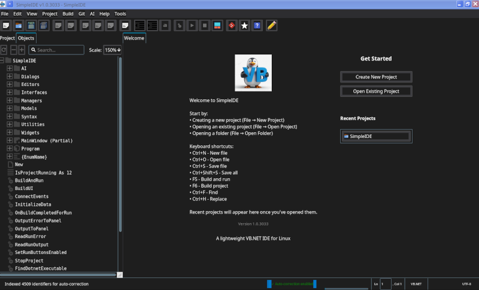
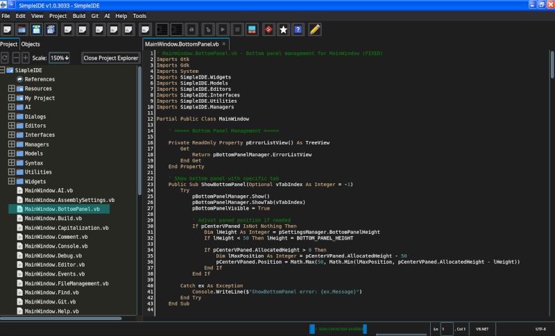

# SimpleIDE

A lightweight, professional VB.NET IDE built with GTK# 3 on Linux using .NET 8.0. SimpleIDE provides a modern development environment specifically designed for VB.NET projects on Linux systems.




## Discord Channel

https://discordapp.com/channels/682603493386747904/1408457691734737007

## Features

### Code Editor
- **Multi-file tabbed editing** with automatic file type detection
- **VB.NET syntax highlighting** with customizable color themes
- **Line numbers** with click-to-select and drag-to-select functionality
- **Smart indentation** and automatic bracket matching
- **Undo/Redo system** (Ctrl+Z, Ctrl+R) with per-character tracking
- **Code folding** for classes, methods, properties (including Get/Set), and regions
- **Intelligent code completion** with hover tooltips and parameter hints
- **Real-time syntax error detection** with squiggly underlines

### Project Management
- **Project Explorer** with .vbproj file parsing and management
- **Object Explorer** showing hierarchical code structure
- **Auto-detection** of project files in current directory
- **Solution and project file support** (.sln, .vbproj)
- **Reference management** for NuGet packages and assemblies

### Build System
- **Integrated build system** using dotnet CLI
- **Async build operations** with real-time output
- **Dockable build output panel** with error/warning navigation
- **One-click build and run** (F5/F6)
- **Support for Debug and Release configurations**
- **Click-to-navigate** error and warning messages

### AI Integration
- **Claude AI assistant** for code generation and refactoring
- **Multiple chat conversations** with persistent history
- **Claude Projects integration** for context-aware assistance
- **Code explanation** and documentation generation
- **Smart code suggestions** based on project context

### User Interface
- **Dark and Light themes** with system theme detection
- **Customizable toolbar** with common actions
- **Enhanced status bar** showing cursor position, language mode, and encoding
- **Welcome splash screen** with recent projects
- **Dockable panels** for tools and output
- **Integrated help system** with searchable documentation

### Developer Tools
- **Git integration** for version control operations
- **Find and Replace** with regex support (Ctrl+F)
- **Go to line** navigation (Ctrl+G)
- **Block commenting** (Ctrl+/)
- **Settings persistence** across sessions

## Installation

### Prerequisites
- Linux operating system (Ubuntu 20.04+, Debian 11+, Fedora 34+, or similar)
- .NET 8.0 SDK
- GTK# 3.24 or higher
- Git

### Install .NET 8.0
```bash
# Ubuntu/Debian
wget https://packages.microsoft.com/config/debian/12/packages-microsoft-prod.deb -O packages-microsoft-prod.deb
sudo dpkg -i packages-microsoft-prod.deb
rm packages-microsoft-prod.deb
sudo apt-get update
sudo apt-get install -y dotnet-sdk-8.0

# Fedora
sudo dnf install dotnet-sdk-8.0
```

### Install GTK# Dependencies
```bash
# Ubuntu/Debian
sudo apt-get install libgtk-3-0 libgtk-3-dev

# Fedora
sudo dnf install gtk3 gtk3-devel
```

### Build SimpleIDE
```bash
# Clone the repository
git clone https://github.com/jamesplotts/simpleide.git
cd simpleide

# Restore dependencies
dotnet restore SimpleIDE.sln

# Build the project
dotnet build SimpleIDE.sln --configuration Release

# Run SimpleIDE
dotnet run --project SimpleIDE.vbproj --configuration Release
```

Note: the repo root holds three project files (`SimpleIDE.vbproj` the main app,
`SimpleIDE.Widgets.vbproj` the reusable control library, `SimpleIDE.WebKitGtk.vbproj` the
WebKitGTK rendering backend - see "Embedded browser architecture" below) plus
`SimpleIDE.sln`. With more than one project file present, `dotnet` commands need to be
told explicitly which one to use - hence `SimpleIDE.sln` for build/restore and
`--project SimpleIDE.vbproj` for run/publish, rather than the bare `dotnet build`/
`dotnet run` that worked with the old single-project layout.

### Embedded browser architecture (Help tab)

The Help tab renders real documentation pages (e.g. `learn.microsoft.com`) inline through
one of two interchangeable rendering backends, selected automatically at runtime by
`Managers/EmbeddedBrowserFactory.vb`:

1. **WebKitGTK** (`SimpleIDE.WebKitGtk.vbproj`, `Widgets/CustomDrawWebView.vb`) - full,
   real, JavaScript-capable rendering via the system's `libwebkit2gtk-4.1`. Preferred
   whenever that library is present. Linux-only (WebKitGTK has no Windows build), hand-rolled
   P/Invoke against the native C API rather than any pre-built binding (see
   `Interop/WebKitNative.vb`'s header comment for why).
2. **litehtml** (`Widgets/CustomDrawHtmlView.vb`, vendored native shim) - lightweight,
   genuinely cross-platform, but no JavaScript at all. Always available once its bundled
   `.so` is built (see below), and the automatic fallback whenever WebKitGTK isn't - which
   also makes it the *only* backend on a platform that doesn't have WebKitGTK.

Both are entirely optional in the sense that the Help tab still works with neither built:
SimpleIDE just opens links in your system's default browser instead, exactly as before
either backend existed. A Preferences toggle ("Prefer native WebKit rendering when
available", General tab) lets you force the litehtml fallback for troubleshooting without
uninstalling WebKitGTK.

#### Building the litehtml backend
```bash
# Ubuntu/Debian
sudo apt-get install -y cmake pkg-config libcairo2-dev libpango1.0-dev libgdk-pixbuf-2.0-dev

# Fedora
sudo dnf install cmake pkgconf-pkg-config cairo-devel pango-devel gdk-pixbuf2-devel

# Fetch the vendored litehtml source (submodule)
git submodule update --init --recursive

# Build the native shim
./native/build-native.sh
```

This produces `native/build/lib/liblitehtml_shim.so`; a subsequent `dotnet build` picks it
up automatically and bundles it into the output directory. No native toolchain is required
to build or run SimpleIDE itself - this step is purely additive.

#### Building the WebKitGTK backend

Nothing to build - `SimpleIDE.WebKitGtk.vbproj` is pure managed code (P/Invoke, no vendored
native source). It just needs `libwebkit2gtk-4.1-0` installed at runtime:
```bash
# Ubuntu/Debian
sudo apt-get install -y libwebkit2gtk-4.1-0

# Fedora
sudo dnf install webkit2gtk4.1
```
`CustomDrawWebView.IsAvailable` probes for this at runtime (never a hard
`DllNotFoundException`) and the factory falls back to litehtml if it's missing.

#### Porting to another platform (e.g. Windows)

This is the reason `Widgets/` was split into its own assembly in the first place. A fork
targeting Windows (or any platform without WebKitGTK) doesn't need to touch or understand
the rest of the app:

1. Reference `SimpleIDE.Widgets.vbproj` (the reusable control library - buttons, text
   boxes, `CustomDrawHtmlView`, theming, etc. - none of it Linux-specific).
2. Implement `Interfaces/IEmbeddedBrowserView` (defined in `SimpleIDE.Widgets.vbproj`)
   against whatever rendering engine is available on the target platform - WebView2 and CEF
   are the natural choices on Windows - as a `Gtk.Widget` subclass in a new
   `SimpleIDE.<Backend>.vbproj`, following `Widgets/CustomDrawWebView.vb` as a reference
   implementation (its P/Invoke specifics are WebKitGTK-only, but the widget-lifecycle
   pattern - wrap a native view as a child widget, forward navigation events, no
   navigation policy of its own - carries over).
3. Add one more preference check to `Managers/EmbeddedBrowserFactory.Create()`.

Nothing in `HelpBrowser.vb` or anywhere else in the main app needs to change - it only ever
talks to the `IEmbeddedBrowserView` interface, never a concrete provider type.

## Usage

### Command Line Interface
```bash
# Launch with auto-detection (finds .vbproj in current directory)
SimpleIDE

# Open specific project
SimpleIDE MyProject.vbproj

# Create new project
SimpleIDE -n MyApp -t Console

# Show help (lists all available options)
SimpleIDE --help

# Show version information
SimpleIDE --version
```

Run `SimpleIDE --help` for the full list of options - there are quite a few beyond the basics above (window state, safe mode, settings reset, and several project-maintenance flags).

### Test Mode for Diagnostics (For Claude/AI Assistants)

**IMPORTANT FOR CLAUDE**: The IDE has a special test mode that allows running it headlessly with automatic exit for diagnostic purposes. This is particularly useful when debugging parsing issues or checking project loading without a display.

```bash
# Run in test mode - exits after 5 seconds by default
dotnet run --project SimpleIDE.vbproj -- --test-mode

# Run with custom delay (in milliseconds)
dotnet run --project SimpleIDE.vbproj -- --test-delay 5000 --test-mode

# Test with a specific project
dotnet run --project SimpleIDE.vbproj -- --test-mode --project /path/to/project.vbproj

# Build and test
dotnet build SimpleIDE.sln
dotnet run --project SimpleIDE.vbproj -- --test-mode --test-delay 3000
```

(`--project SimpleIDE.vbproj` is required now that the repo root has multiple project
files - see "Build SimpleIDE" above. A bare `dotnet run`/`dotnet build` errors with
`MSB1011: Specify which project or solution file to use`.)

If you're running without a real X11/Wayland display available (e.g. a bare CI container), wrap the command with `xvfb-run -a`. A real display is used directly otherwise - `xvfb` is not a hard requirement.

**What Test Mode Does:**
- Starts the IDE and automatically loads the project (auto-detects or uses `--project`)
- Outputs all parsing and loading diagnostics to console
- Shows which files are being parsed and any errors
- Exits automatically after the specified delay
- Useful for checking if Object Explorer population is working
- Helps diagnose Roslyn parser initialization issues

### Keyboard Shortcuts

#### File Operations
- **Ctrl+S** - Save current file
- **Ctrl+Shift+S** - Save all files

#### Editing
- **Ctrl+Z** - Undo
- **Ctrl+Shift+Z** / **Ctrl+R** - Redo
- **Ctrl+Y** - Cut current line (VB.NET classic shortcut)
- **Ctrl+X** - Cut
- **Ctrl+C** - Copy
- **Ctrl+V** - Paste
- **Ctrl+Shift+V** - Smart paste (strips comment markers and re-indents to the paste location)
- **Ctrl+A** - Select all
- **Ctrl+F** - Find
- **Ctrl+H** - Find and replace
- **Ctrl+G** - Go to line
- **Ctrl+/** - Toggle line comment
- **Tab** / **Shift+Tab** - Indent / outdent the current selection
- **Ctrl+Space** - Trigger code completion (CodeSense) at the cursor

#### View
- **Ctrl++** / **Ctrl+-** / **Ctrl+0** - Zoom in / out / reset editor font size
- **Ctrl+E** - Toggle Project Explorer
- **F11** - Toggle full screen

#### Build and Run
- **F5** - Build and run
- **F6** - Build project
- **Ctrl+B** - Build project

#### Navigation
- **F1** - Context-sensitive help
- **F2** - Quick find from clipboard
- **F3** / **Shift+F3** - Find next / previous
- **F12** - Go to definition
- **Ctrl+Tab** - Next tab
- **Escape** - Context-sensitive close (code completion popup, then Find panel, then clears selection)

Some shortcuts shown in menus (Find in Files, Build Solution, Run without debugging) are wired up but not yet implemented behind the scenes.

## Project Structure

```
SimpleIDE/
├── Program.vb                        # Entry point
├── MainWindow.vb                     # Main IDE window
├── MainWindow.*.vb                   # Partial classes for main window
├── Editors/
│   ├── CustomDrawingEditor.vb        # Main code editor implementation
│   └── CustomDrawingEditor.*.vb      # Partial classes (folding, drawing, keyboard, etc.)
├── Widgets/
│   ├── CustomDrawProjectExplorer.vb  # Project tree view
│   ├── CustomDrawObjectExplorer.vb   # Code structure view
│   └── BuildOutputPanel.vb           # Build output display
├── Models/
│   ├── SourceFileInfo.vb             # File content and metadata
│   └── EditorTheme.vb                # Theme definitions
├── Syntax/
│   ├── SyntaxNode.vb                 # Syntax tree node representation
│   └── VBSyntaxHighlighter.vb        # Syntax highlighting engine
├── Parsers/
│   └── RoslynConverter.vb            # Converts Roslyn syntax trees to SimpleIDE's model
├── Managers/
│   ├── ProjectManager.vb             # Project file management
│   ├── BuildManager.vb               # Build system integration
│   └── SettingsManager.vb            # Settings persistence
├── Utilities/
│   ├── FileOperations.vb             # File operations
│   └── CssHelper.vb                  # GTK CSS styling
└── Resources/
    └── *.png                         # Embedded icons and images
```

Parsing is Roslyn-based (`Microsoft.CodeAnalysis.VisualBasic`) rather than a hand-written parser.

This tree shows physical folders, not assembly boundaries - files aren't moved between
project files, they're just compiled by different `.vbproj`s (`EnableDefaultCompileItems`
is off, so every file is listed explicitly in whichever project owns it). A handful of
`Widgets/`/`Managers/`/`Models/`/`Utilities/` files with no IDE-specific dependencies
(`ThemeManager`, `SettingsManager`, `EditorTheme`, the generic `CustomDraw*` controls,
`CustomDrawHtmlView`, etc.) are compiled into `SimpleIDE.Widgets.vbproj` instead of the
main `SimpleIDE.vbproj` - see "Embedded browser architecture" above for why.

## Screenshots

### Main Editor View


## Configuration

### Settings File Location
Settings are stored in `~/.config/SimpleIDE/settings.json`. Code-folding expansion state is stored separately in `~/.config/SimpleIDE/foldstate.json`.

Settings are managed through the IDE's Settings dialog rather than hand-edited; the file holds properties such as `EditorFont`, `TabWidth`, `UseTabs`, `CurrentTheme`, `ShowLineNumbers`, and `SyntaxHighlighting`.

## Development

### Coding Conventions

The project follows strict coding conventions:

1. **Hungarian Notation** for variables:
   - `l` = Local variable
   - `p` = Private field
   - `v` = Parameter
   - `g` = Global variable

2. **Enum Pattern**: All enums start with `eUnspecified` and end with `eLastValue`

3. **XML Documentation**: All public members must have XML documentation comments

4. **Error Handling**: Try-Catch blocks in all methods with console logging

### Building from Source

```bash
# Debug build
dotnet build SimpleIDE.sln --configuration Debug

# Release build
dotnet build SimpleIDE.sln --configuration Release

# Create self-contained executable
dotnet publish SimpleIDE.vbproj -c Release -r linux-x64 --self-contained
```

## Contributing

Contributions are welcome! Please follow these guidelines:

1. Fork the repository
2. Create a feature branch (`git checkout -b feature/amazing-feature`)
3. Follow the coding conventions documented in the project
4. Ensure all XML documentation is complete
5. Test your changes thoroughly
6. Commit your changes (`git commit -m 'Add amazing feature'`)
7. Push to the branch (`git push origin feature/amazing-feature`)
8. Open a Pull Request

## Known Issues

- TextBuffer operations require `SelectRange` + `DeleteSelection` instead of `Delete`
- Icon resources must use full namespace: `SimpleIDE.icon.png`
- GTK# Path conflicts require fully qualified `System.IO.Path`

## License

This project is licensed under the MIT License - see the [LICENSE](LICENSE) file for details.

## Acknowledgments

- GTK# team for the excellent .NET bindings
- Microsoft for .NET 8.0 and VB.NET
- The open source community for inspiration and support

*Note: IntelliSense is a registered trademark of Microsoft Corporation. SimpleIDE's code completion features are independently developed.*

## Contact

- **Author**: James Duane Plotts
- **Repository**: [https://github.com/jamesplotts/simpleide](https://github.com/jamesplotts/simpleide)
- **Issues**: [https://github.com/jamesplotts/simpleide/issues](https://github.com/jamesplotts/simpleide/issues)
- **Donate**: [https://buymeacoffee.com/jamesplotts](https://buymeacoffee.com/jamesplotts)

---

*SimpleIDE - Bringing professional VB.NET development to Linux*
